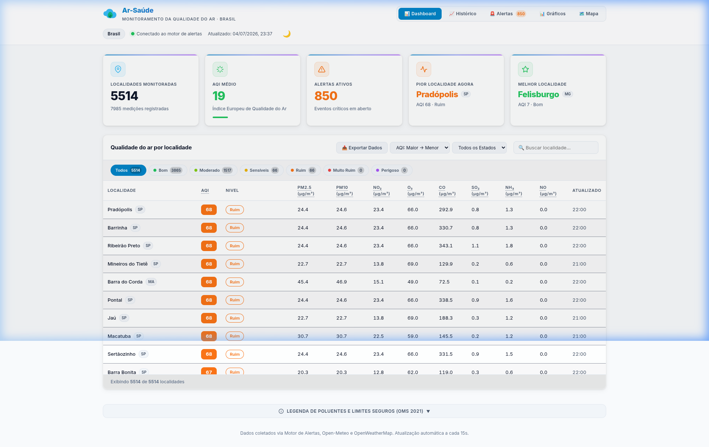
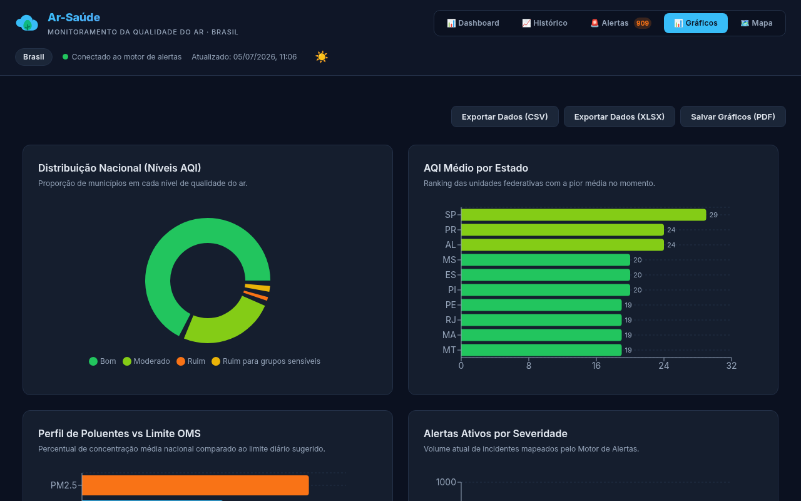
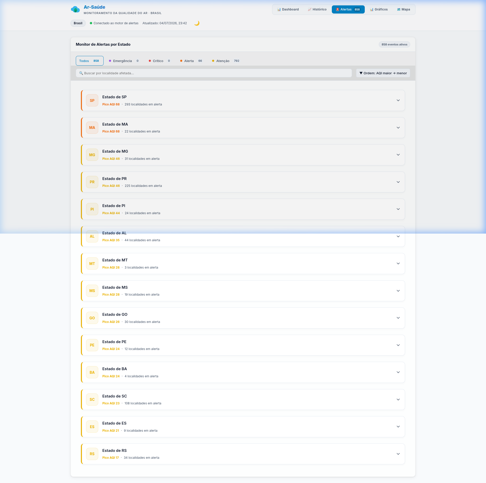
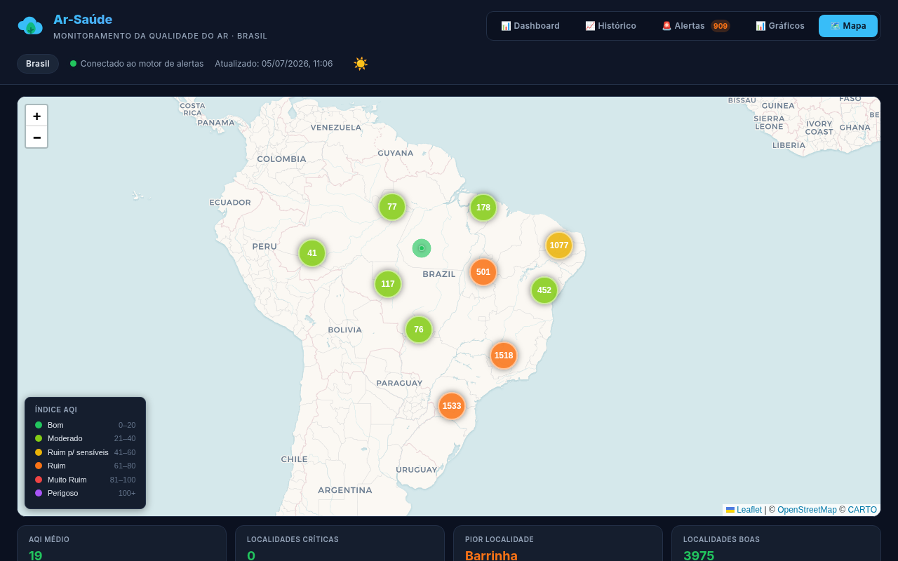
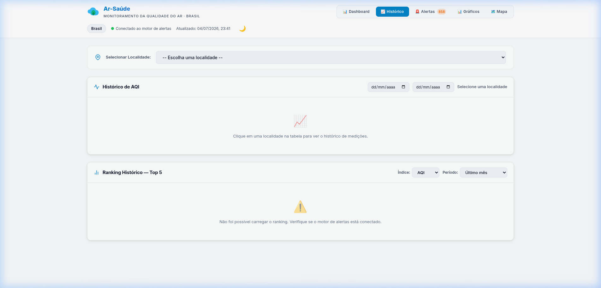

# 🌬️ Ar-Saúde — Plataforma de Monitoramento da Qualidade do Ar

O **Ar-Saúde** é um sistema distribuído (baseado em microsserviços) criado para monitorar, alertar e visualizar em tempo real a qualidade do ar em todos os municípios do Brasil. 

Recentemente reconstruído com foco em **Mobile-First** e **Analytics avançado**, o projeto utiliza **TypeScript**, **Nest.js**, e **Next.js** para entregar uma experiência fluida, responsiva e altamente escalável.

## ✨ O que há de novo na versão atual?
- **Redesign Mobile (Bottom Navigation)**: Experiência focada em dispositivos móveis com barra de navegação inferior estilo aplicativo, painéis responsivos e otimização de `safe-area`.
- **Analytics e Gráficos Avançados**: Nova aba dedicada para visualização analítica (Gráficos Recharts) com ranking dos piores estados, análise de poluentes em relação aos limites da OMS e top 5 das melhores/piores cidades.
- **Inteligência de Alertas por Estado**: Alertas críticos e emergenciais agrupados hierarquicamente por Unidade Federativa (UF), facilitando a gestão e visão macro de regiões afetadas.
- **Nomenclatura Dinâmica**: Integração nativa de IBGE-UF mapeando automaticamente todos os municípios para suas respectivas siglas estaduais.

---

## 📸 Interface Web

### 📈 Painel Principal (Dashboard)


### 📊 Gráficos e Analytics (Novo!)


### 🚨 Alertas Agrupados por Estado


### 🗺️ Mapa Interativo (Clusterizado)


### 🕒 Histórico Temporal


---

## 🏗️ Arquitetura de Implantação (Produção)

O sistema foi arquitetado para ser resiliente e distribuído, garantindo alta disponibilidade. A topologia de produção foca em eficiência e divide a carga da seguinte maneira:

### 🍓 1. Raspberry Pi 4 
O hardware principal responsável por rodar os microsserviços da aplicação, a interface do usuário e a camada de observabilidade.
- **Microsserviço 1 (Coletor)**: Roda internamente na porta **3000**.
- **Microsserviço 2 (Motor de Alertas)**: Roda na porta **3001**.
- **Frontend (Dashboard Next.js)**: Roda na porta **3002**.
- **Stack de Monitoramento**:
  - **Prometheus**: Porta **9090**.
  - **Grafana**: Porta **3003**.

### 🌐 2. Exposição via Cloudflare Tunnels
Para garantir acesso seguro aos serviços locais a partir da internet, sem a necessidade de abrir portas no roteador, o sistema utiliza **Cloudflare Tunnels**. Abaixo estão os domínios de produção configurados:

| Serviço | Domínio Público | Destino Local (Infraestrutura) |
| :--- | :--- | :--- |
| **Frontend (Dashboard)** | `https://arsaude.rasppi.cloud` | `http://192.168.100.17:3002` (Raspberry Pi) |
| **Motor de Alertas (API)** | `https://alertas.rasppi.cloud` | `http://192.168.100.17:3001` (Raspberry Pi) |
| **Grafana (Observabilidade)** | `https://grafana-ar-saude.rasppi.cloud` | `http://192.168.100.17:3003` (Raspberry Pi) |
| **Prometheus (Métricas)** | `https://prometheus-ar-saude.rasppi.cloud` | `http://192.168.100.17:9090` (Raspberry Pi) |

---

## ⚙️ Arquitetura Lógica e Microsserviços

O sistema é dividido em três grandes pilares, garantindo alta escalabilidade e separação de responsabilidades:

```text
  ┌─────────────────┐       ┌─────────────────┐       ┌─────────────────┐
  │   APIs Externas │ ────> │ Microsserviço 1 │ ────> │ Microsserviço 2 │
  │(OpenWeatherMap) │       │    (Coletor)    │       │(Motor Alertas)  │
  └─────────────────┘       └─────────────────┘       └────────┬────────┘                                          │
                                                               │ (SSE / APIs)
                                                               ▼
  ┌─────────────────┐                                 ┌─────────────────┐
  │    Usuário      │ <────────────────────────────── │    Frontend     │ 
  │ (Desktop/Mobile)│                                 │   (Next.js)     │ 
  └─────────────────┘                                 └─────────────────┘
```

### 1. Microsserviço 1: Coletor (Diretório `/src` - NestJS)
Sua principal responsabilidade é rodar rotinas agendadas (Cron Jobs) que consultam as coordenadas geográficas dos municípios brasileiros nas APIs meteorológicas externas.
- **Coleta Otimizada**: Consulta a **OpenWeatherMap API** para capturar índices de qualidade do ar (AQI) e gases poluentes (PM2.5, PM10, CO, NO, NO₂, O₃, SO₂, NH₃).
- **Publicação (Push Model)**: Formata os dados enriquecidos e realiza um **HTTP POST** de ingestão de dados diretamente na API do Motor de Alertas.
- **Resiliência**: Utiliza uma fila de processamento em memória e um sistema de **Cache com Redis** para absorver milhares de requisições de todos os municípios, respeitando rigidamente o *rate limit* das APIs públicas e evitando falhas na carga massiva de dados.

### 2. Microsserviço 2: Motor de Alertas (Diretório `/motor-alertas` - NestJS)
É o cérebro avaliativo e central do sistema. Possui banco de dados próprio (**PostgreSQL**).
- Consome os dados de ingestão do **Coletor** através da rota reativa `/measurements/ingest`.
- Avalia as concentrações de poluentes cruzando com os limites de segurança da OMS (Organização Mundial da Saúde).
- Gera e persiste **Alertas** críticos (ex: PM2.5 muito alto) agrupando-os de forma inteligente por localidade e estado.

### 3. Frontend: Dashboard (Diretório `/frontend` - Next.js)
Interface para o usuário final, construída com React.
- **Painel Analítico Mobile-First**: Gráficos responsivos (Top Cidades, Ranking de Estados, Distribuição Nacional) e navegação otimizada.
- **Mapa Geolocalizado**: Para garantir a performance de renderização de mais de 5000 localidades, o mapa utiliza um avançado sistema de clusterização (`Leaflet.markercluster`).
- **Alertas em Tempo Real**: Conecta-se via **SSE** (Server-Sent Events) ao Motor de Alertas para refletir instantaneamente a criação ou resolução de problemas no ar sem precisar atualizar a página.

---

## 🛠️ Como Executar Localmente (Ambiente de Desenvolvimento)

A forma mais simples de colocar todo o sistema no ar em sua máquina é via **Docker Compose**, orquestrando os serviços em um único comando.

### Pré-requisitos
- **Node.js** (versão 20 ou superior)
- **Docker** e **Docker Compose**

### Passo 1: Configuração das Variáveis de Ambiente
Copie e renomeie os arquivos `.env` de exemplo fornecidos:

```bash
# Na raiz do projeto (Coletor):
cp .env.example .env

# Na pasta do Motor de Alertas:
cd motor-alertas && cp .env.example .env && cd ..

# Na pasta do Frontend:
cd frontend && cp .env.example .env && cd ..
```
*No `.env` da raiz, você pode adicionar sua `OPENWEATHER_API_KEY` pessoal.*

### Passo 2: Inicialização via Docker Compose
Na raiz do repositório, levante os containers:
```bash
docker-compose up --build
```
Isso iniciará localmente:
- Coletor-ar (`:3000`)
- Motor-alertas (`:3001`)
- Frontend (`:3002`)
- PostgreSQL (`:5433`)
- Prometheus (`:9090`), Grafana (`:3003`)

Acesse o Dashboard Web em: **http://localhost:3002**

> **Nota**: Ao rodar pela primeira vez, o sistema pode demorar até 20 segundos para preencher a tabela inicial devido à primeira carga do Cron Job de coleta.

---

## 📈 Observabilidade e Testes de Carga

A plataforma foi construída com instrumentação nativa:

- **Métricas**: `GET /metrics` no Coletor e no Motor de Alertas no formato **Prometheus**. Exibidas dinamicamente via **Grafana** (dashboards pré-configurados).

### Teste de Carga

Para rodar os testes fora do Docker (necessita npm install local):

```bash
# 1) Suba o Coletor
npm run start:dev

# 2) Em outro terminal, rodar a rampa de estresse (até 5000 reqs concorrentes)
npm run load:test
```
